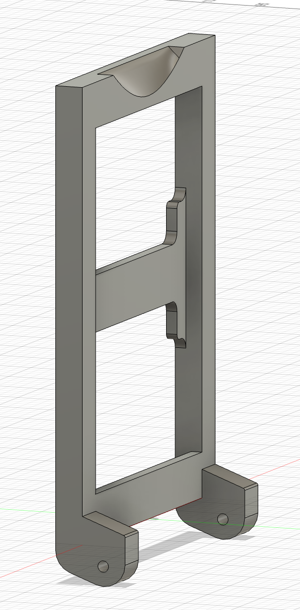
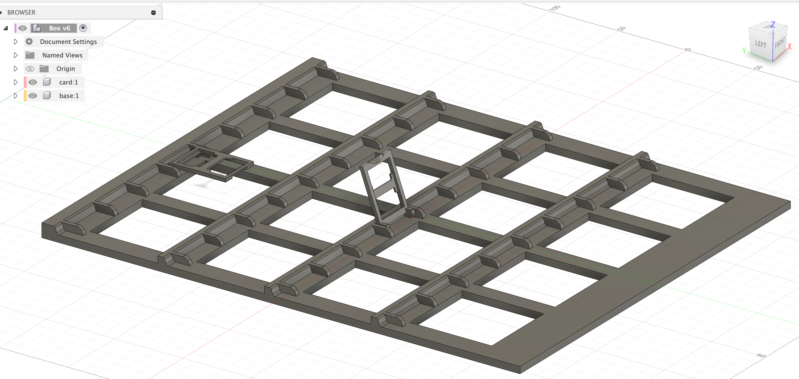
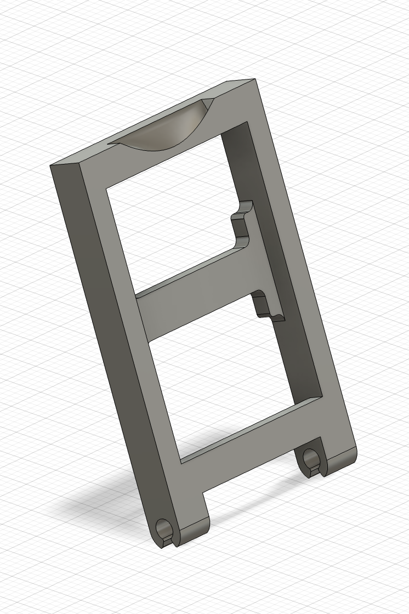
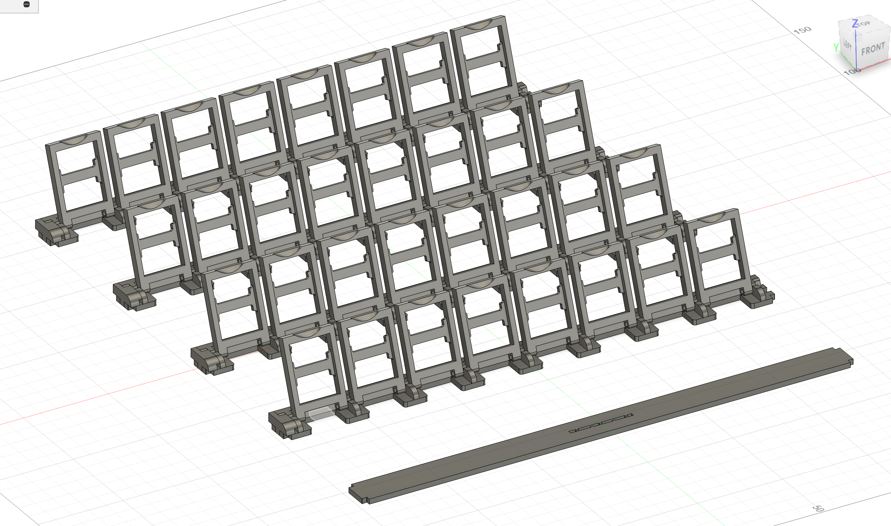

# "Guess Who?" turned into Drum Machine

This project is part of the "Composing With New Music Instruments" course.

## Inspiration

I wanted to make an easy-to-play instrument for all ages. I find that a drum machine is very intuitive to play and easy to make good music out of it. With that in mind I decided to turn the "Guess Who?" game into a drum machine. 

## Project description

The project is a drum machine instrument inspired by the "Guess Who?" game. Its a playful, joyful and interactive experience that can be shared with a friend. Together you can build the sound of your persona or make the next electronic music hit. Its educative and suitable for all ages. 

### How to play:

As you can see from the image bellow, the instrument has two boards, one for each player (just like the normal game). Each board has 4 rows and 8 columns. 

Each row is a sound (kick, snare, hithat, etc) and each column is a step in the 8step drum machine. To make a sound drop the card down where you want it to be played in the sequencer.

This game has two modes to choose from. In mode 1 you turn the drum machine into a 16step where player 1 plays the first 8 steps and player 2 plays the last 8 steps. Or you can choose mode 0 (don’t forget to turn around the cards) where the drum machine stays 8 step but the players have different sounds (so its a 8step drum machine with 8 different sounds in total).

You can either play the game just by dropping the cards down in the specific places you want the sound to be played or you can play the normal "Guess Who?" game with your opponent. When asking questions to try to find your opponents persona you can hear how it sounds like.

More importantly, have fun!

## Design 

My design was inspired by the normal game. I did lot of prototyping to get the best board and card sizes. 

I first designed very similar to the game but later i realized i should change to adapt to my instrument needs.

Bellow you can see the first design of the card and the board of the final design.

## Eletronics

## PD patches

## ToDo's 