# "Guess Who?" turned into Drum Machine

This project is part of the "Composing With New Music Instruments" course.

## Inspiration

I wanted to make an easy-to-play instrument for all ages. I find that a drum machine is very intuitive to play and easy to make good music out of it. With that in mind I decided to turn the "Guess Who?" game into a drum machine. 

## Project description

The project is a drum machine instrument inspired by the "Guess Who?" game. Its a playful, joyful and interactive experience that can be shared with a friend. Together you can build the sound of your persona or make the next electronic music hit. Its educative and suitable for all ages. 

### How to play:

As you can see from the image bellow, the instrument has two boards, one for each player (just like the normal game). Each board has 4 rows and 8 columns. 

Each row is a sound (kick, snare, hithat, etc) and each column is a step in the 8step drum machine. To make a sound drop the card down where you want it to be played in the sequencer.

This game has two modes to choose from. In mode 0 you turn the drum machine into a 16step where player 1 plays the first 8 steps and player 2 plays the last 8 steps. Or you can choose mode 1 (don’t forget to turn around the cards) where the drum machine stays 8 step but the players have different sounds (so its a 8step drum machine with 8 different sounds in total).

You can either play the game just by dropping the cards down in the specific places you want the sound to be played or you can play the normal "Guess Who?" game with your opponent. When asking questions to try to find your opponents persona you can hear how it sounds like.

More importantly, have fun!

## Design 

My design was inspired by the normal game. I did a lot of prototyping to get the best board and card sizes. 

I first designed very similar to the game but later i realized i should change to adapt to my instrument needs.

Bellow you can see the first and last design of both the card and the board, respectively.

  
&nbsp; &nbsp; &nbsp; &nbsp;
  

  
&nbsp; &nbsp; &nbsp; &nbsp;
  

Finally, I built an acrylic box around it so i could place the electronics. 

This is how the design looks like:

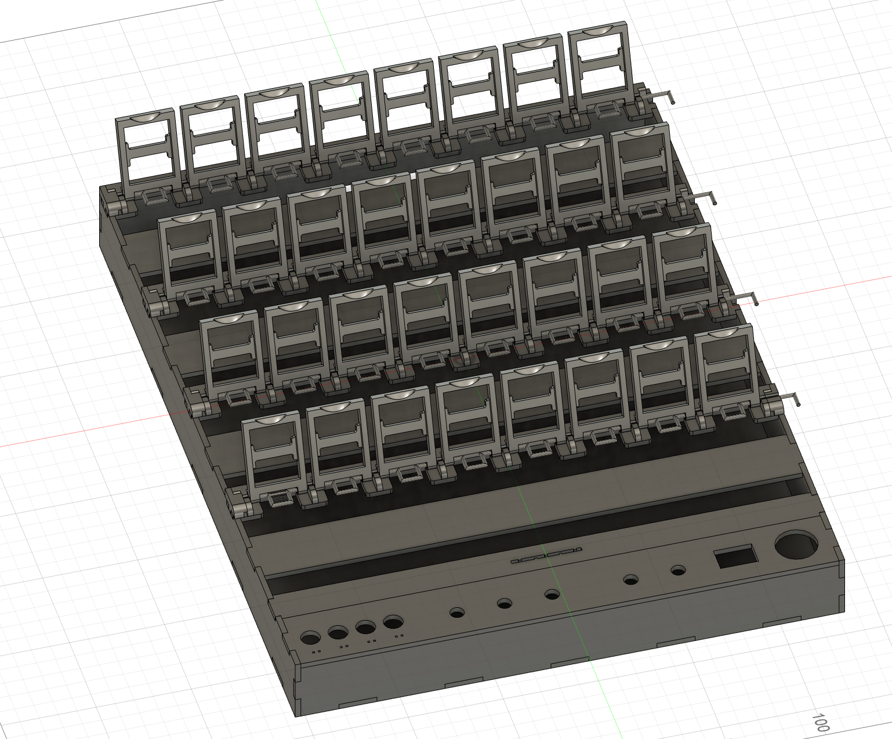

## Electronics

In total I have 8 potentiometers (the max amount Bela board allows considering it only has 8 analog inputs (adc~)), 8 LEDs, 8 buttons, 1 switch button and 1 Start/Stop button. Then I have 3 Trill Sensors and the Bela board. 

I started by testing the electronics individually with Bela.

  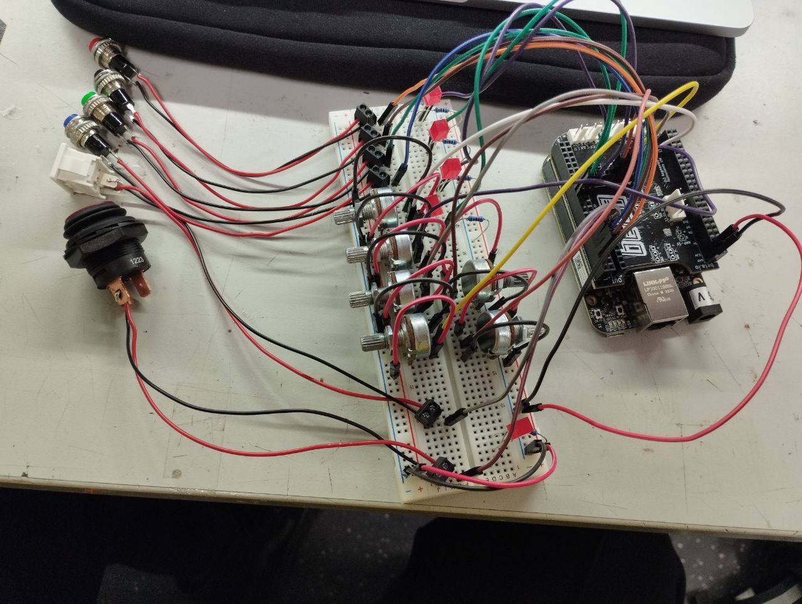
&nbsp; &nbsp; &nbsp; &nbsp;
  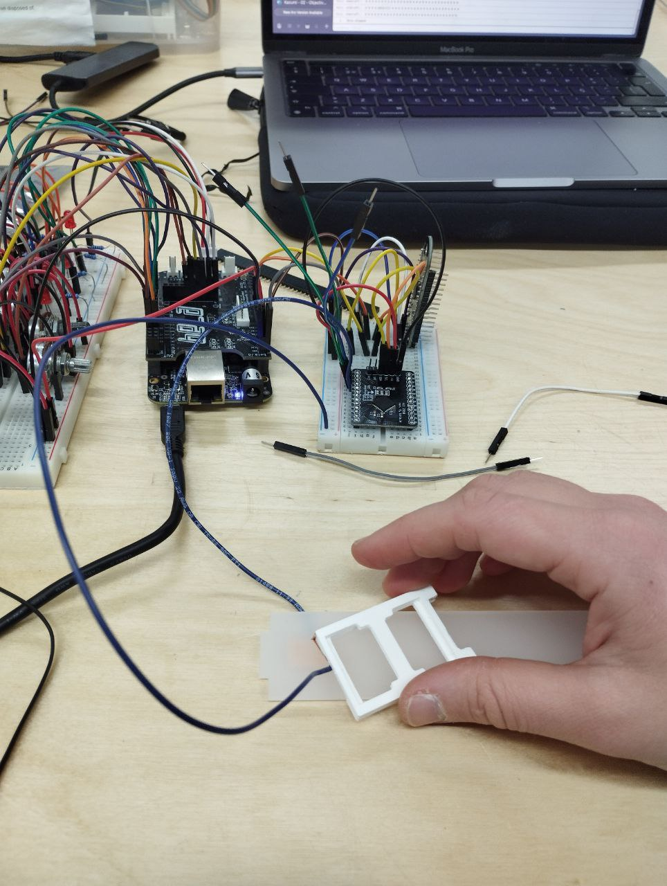

Everything worked as expected as its simple electronics.

## PD patches

To give some context, in my game I have, per player, 4 rows with different sounds and 4 buttons to select the respective
row. Then I only have 3 potentiometers to change decay, filter and volume for each sound/row. When we press button 1 and we play around with the potentiometers we will be changing the values for that sound. Then when we press the button 2 we will be changing the values for that sound without influencing the values of the other sounds/rows.

So, to accomplish this idea, I had to simulate the potentiometers as sliders and see if it worked. Following this flow I decided to make a pd patch where I simulate the whole game using Toggles and sliders to replace the buttons, potentiometers and the conductive cards. 

After making the simulation work, the change to the main pd patch with the electronics is very straight forward as I only had to replace the toggles and sliders to the code for the electronics.

I'm very grateful to have made the simulation path as i believed it saved me some time and helped trouble shooting/debugging.

  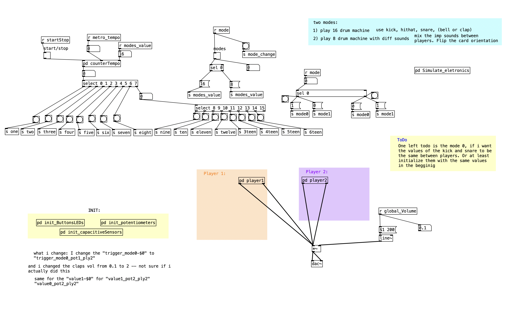
&nbsp; &nbsp; &nbsp; &nbsp;
  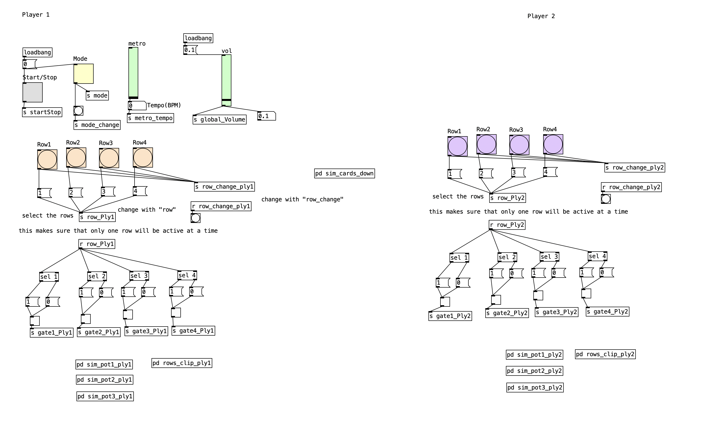

  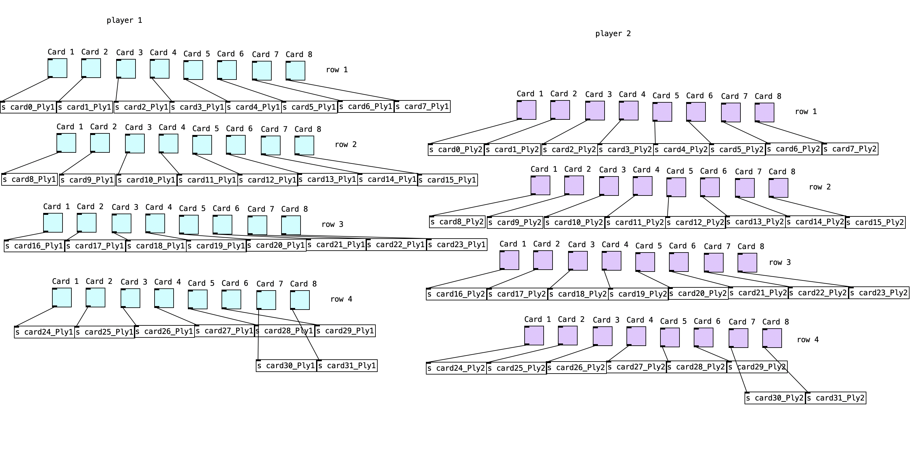
&nbsp; &nbsp; &nbsp; &nbsp;
  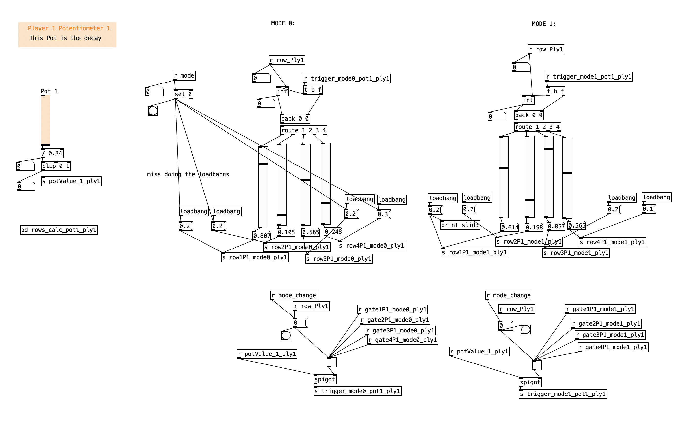

  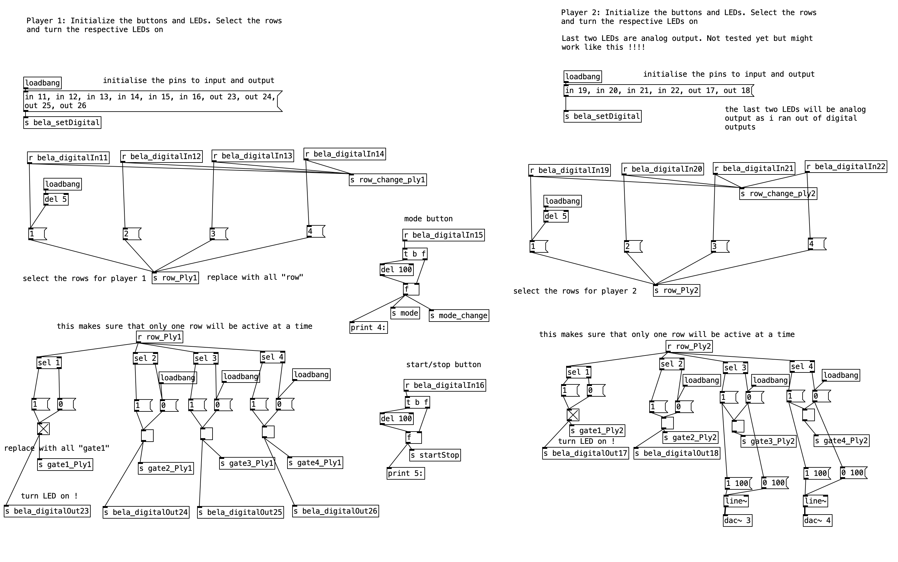
&nbsp; &nbsp; &nbsp; &nbsp;
  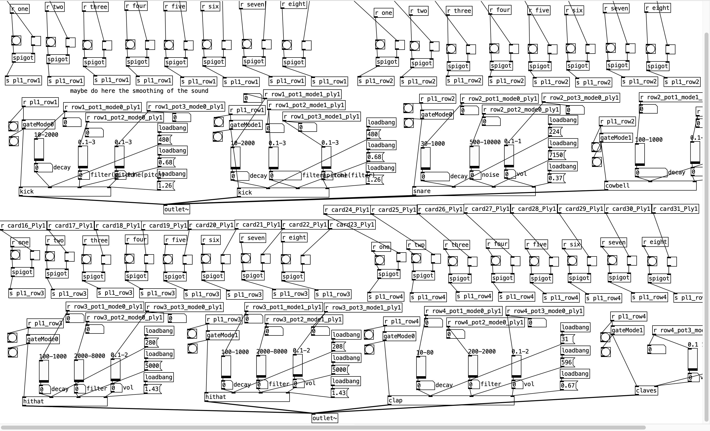

## Combining Everything

Next was time to put all the physical things together and it took me a surprisingly long amount of time to solder and mount all the boxes together.

As if reaching this far wasn’t challenging and time consuming enough, I had CPU problems due to very complex sounds. That was the last challenge where I spent the whole day making the sounds simpler so I would manage to make my
game work with two players. Unfortunatly the sounds are not as clean or sharpe as I would wish but im still very proud to have a working game after soooo much work and challenges. For the Future work i wish to replace Bela board for a computer so i can process everything better and faster.

  
&nbsp; &nbsp; &nbsp; &nbsp;
  

  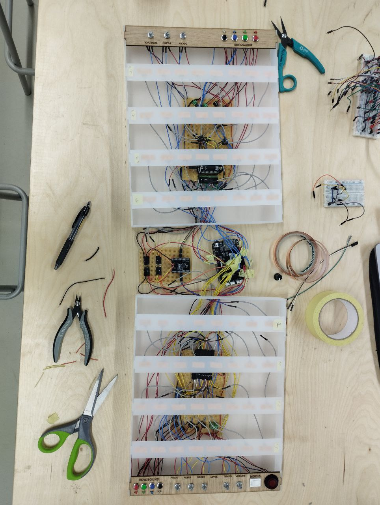
&nbsp; &nbsp; &nbsp; &nbsp;
  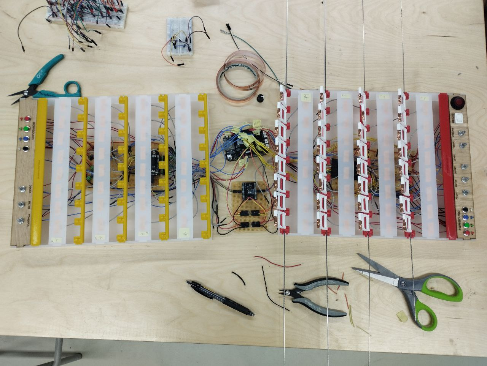

## Making the Cards

Lastly, which also took a surprise amount of time, I made the cards for my game. I decided to make a female only version this time where I selected women that have done great things but are not too known for their work and they should.
The last day before putting the work at the exhibition, I had to edit all the cards in affinity followed by printing, cutting and glueing 264 cards to put them in the card holder.

  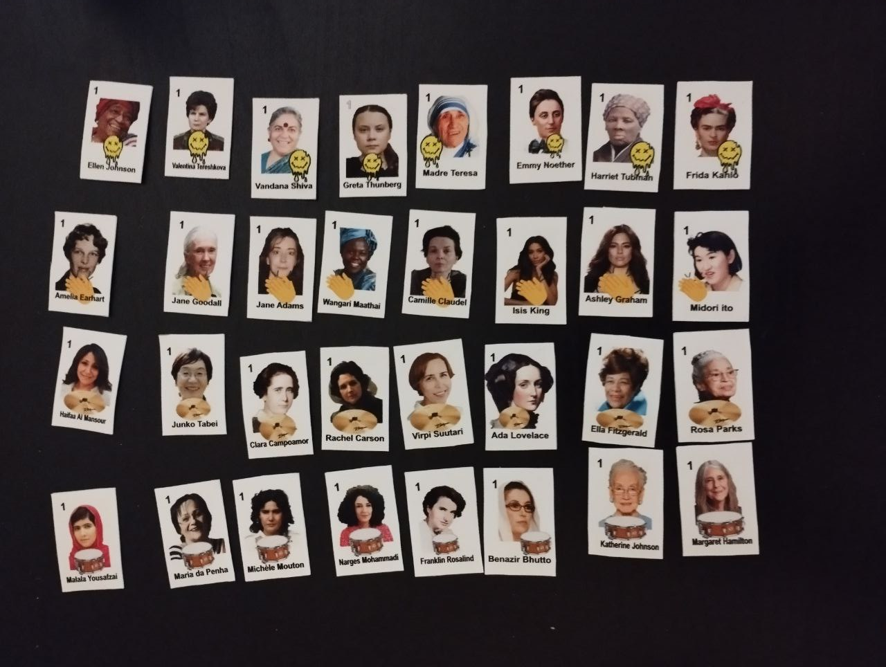
&nbsp; &nbsp; &nbsp; &nbsp;
  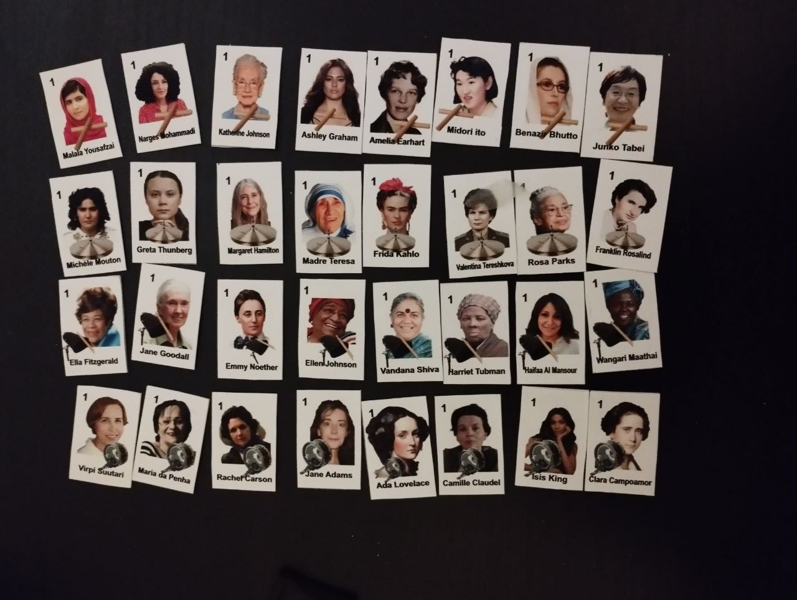

## Cards meaning

I decided to make a woman only edition where I show woman that have done great things in history that should be more known by their great dos. Unfortunately, in a man nominated words some of them have been/ were shut down.

* Franklind Rosaline --  was a British chemist that found DNA. The credits were stollen by two man
* jane goodall --- She is considered the world's foremost expert on chimpanzees. Worked extensively on conservation and animal welfare issues. she was named a United Nations Messenger of Peace. 
* Malala Yousafzai -- Pakistani female activist and defensor of the human & woman rights. She is the youngest Nobel Prize laureate in history. Recieved the Nobel Peace Prize laureate at the age of 17.
* Isis King -- is an American model, actress, and fashion designer. She was the first openly trans woman to compete on the show America's Next Top Model
* Ashley Graham -- North- American model. Graham is a proponent of the body positivity and the Health at Every Size movements. In 2016, she became the first size 16 model to be featured on the cover of Sports Illustrated Swimsuit Issue.
* Ellen Johnson Sirleaf -- is a Liberian politician. Sirleaf was the first elected female head of state in Africa.
* Vandana Shiva -- is an Indian scholar, environmental activist, food sovereignty advocate, ecofeminist and anti-globalization author. Shiva plays a major role in the global ecofeminist movement.
* Wangari Maathai --- Maathai was a Kenyan social, environmental, and political activist. Was the first african woman receiving nobel price of peace
* Rachel Carson --- environmentalist and criator of the Day of the Earth
* Emmy Noether -- German. Most important female mathematicians in the history.
* Michèle Mouton -- first and only woman ever winning a stage of the World Rally Championship. The Greatest Female Driver in History
* Haifaa Al Mansour -- is a Saudi Arabian film director. She is one of the country's best-known and one of the first female Saudi filmmakers.
* Valentina Tereshkova —- first woman going to space 
* Maria da Penha -- Brasilian and defensor of female rights. Help with domestic valice. 
* Greta Thunberg -- is climate activist. She gained international prominence for her straightforward approach to climate change advocacy, starting with her school strike for climate in 2018.  

ToDo (miss writting 16 left)
* Frida Kahlo - pintora mexican, a artista é reconhecida também como um emblema feminista. Isso porque mesmo não se identificando como tal, teve uma postura marcada contra o sistema patriarcal e impôs suas ideias de forma criativa e decidida.

## Feedback

I’ve receive amazing feedback from the people attending the exhibition and that’s the best price ever after so much work put into it. People loved it and were having so much fun playing with it. I was so happy to see my friends having so much fun
playing together with my instrument and I must say that I’ve recorded amazing bangers from those people that walked in not even knowing what a drum machine is. 

I would like to continue with this project and improve some things. I’ve head some feedback and ideas from people that I could do on the next iteration. My goal is also to apply for the Sonar festival in barcelona in 2025 with this instrument.

Overall, I’m very grateful I took this course as ive learn so much and discovered
another word of new media art possibilities.

  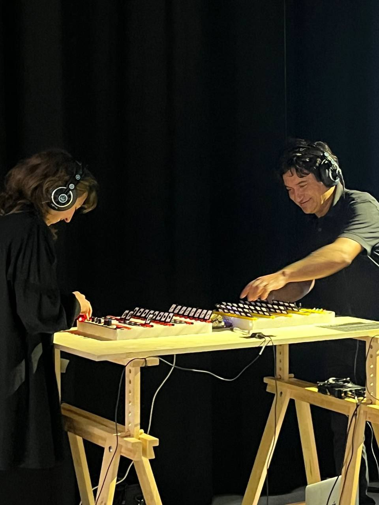
&nbsp; &nbsp; &nbsp; &nbsp;
  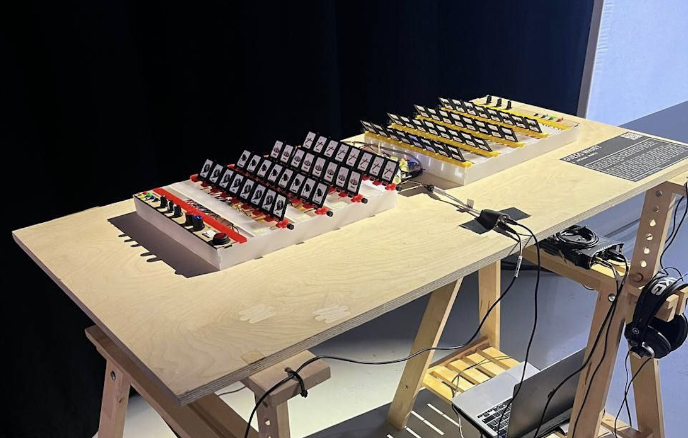

## ToDo's / Future work

Based on people's feedback I wish to change some things on the work:

* Make the tempo faster
* Improve the sounds and make the sound of the player 1 more interesting, like the acid on player 2
* Add the vinyl cut color circles to signalize which row is being edit with the buttons.
* At the moment i only have the images of the instruments but i would like to had the faces so the players can play the normal "Guess Who?" game and hear how it sounds like. I think this way of playing adds a new dimension to the instrument. Every game will compose a new unique song. 
* Make another use of mode 0. Not just because its not too interesting to play but also because flipping all the 32 cards to change the mode is not the most efficient, fast or interesting (and changing the design of the cards is not something i want to do). Two ways i could do this:
  1. Do a blind mode 0 to enhance peoples sensibility and embodiment to the sounds and creativity on their reactions. Having 8 step sequencer with 8 different sounds from the mode 1.
  2. Make the mode 0 be the one where people play the normal "Guess Who?" game maintain it has a 16 step sequencer where the 1st player composes the first 8 steps influenced by their questions and the second player composes the following 8 steps.
