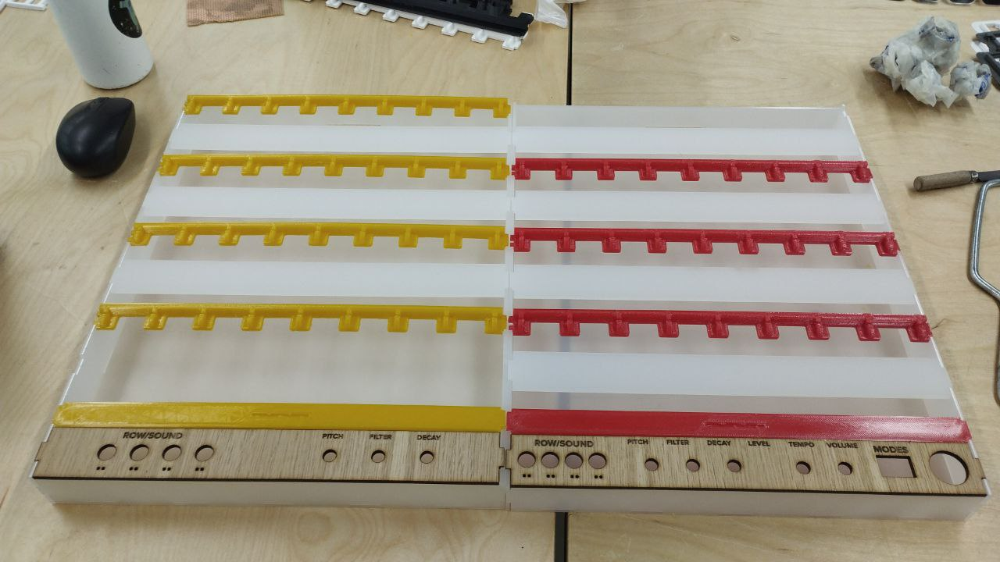

# "Guess Who?" turned into Drum Machine

This project is part of the "Composing With New Music Instruments" course.

## Inspiration

I wanted to make an easy-to-play instrument for all ages. I find that a drum machine is very intuitive to play and easy to make good music out of it. With that in mind I decided to turn the "Guess Who?" game into a drum machine. 

## Project description

The project is a drum machine instrument inspired by the "Guess Who?" game. Its a playful, joyful and interactive experience that can be shared with a friend. Together you can build the sound of your persona or make the next electronic music hit. Its educative and suitable for all ages. 

### How to play:

As you can see from the image bellow, the instrument has two boards, one for each player (just like the normal game). Each board has 4 rows and 8 columns. 

Each row is a sound (kick, snare, hithat, etc) and each column is a step in the 8step drum machine. To make a sound drop the card down where you want it to be played in the sequencer.

This game has two modes to choose from. In mode 1 you turn the drum machine into a 16step where player 1 plays the first 8 steps and player 2 plays the last 8 steps. Or you can choose mode 0 (don’t forget to turn around the cards) where the drum machine stays 8 step but the players have different sounds (so its a 8step drum machine with 8 different sounds in total).

You can either play the game just by dropping the cards down in the specific places you want the sound to be played or you can play the normal "Guess Who?" game with your opponent. When asking questions to try to find your opponents persona you can hear how it sounds like.

More importantly, have fun!

## Design 

My design was inspired by the normal game. I did a lot of prototyping to get the best board and card sizes. 

I first designed very similar to the game but later i realized i should change to adapt to my instrument needs.

Bellow you can see the first and last design of both the card and the board, respectively.

  
&nbsp; &nbsp; &nbsp; &nbsp;
  

  
&nbsp; &nbsp; &nbsp; &nbsp;
  

Finally, I built an acrylic box around it so i could place the eletronics. 

This is how the design looks like:

## Eletronics

## PD patches
 
## Cards meaning

I decided to make a woman only edition where I show woman that have done great things in history that should be more known by their great dos. Unfortunatly, in a man nominated worls some of them have been/ were shut down.

* Franklind Rosaline --  was a British chemist that found DNA. The credits were stollen by two man
* jane goodall --- She is considered the world's foremost expert on chimpanzees. Worked extensively on conservation and animal welfare issues. she was named a United Nations Messenger of Peace. 
* Malala Yousafzai -- Pakistani female activist and defensor of the human & woman rights. She is the youngest Nobel Prize laureate in history. Recieved the Nobel Peace Prize laureate at the age of 17.
* Isis King -- is an American model, actress, and fashion designer. She was the first openly trans woman to compete on the show America's Next Top Model
* Ashley Graham -- North- American model. Graham is a proponent of the body positivity and the Health at Every Size movements. In 2016, she became the first size 16 model to be featured on the cover of Sports Illustrated Swimsuit Issue.
* Ellen Johnson Sirleaf -- is a Liberian politician. Sirleaf was the first elected female head of state in Africa.
* Vandana Shiva -- is an Indian scholar, environmental activist, food sovereignty advocate, ecofeminist and anti-globalization author. Shiva plays a major role in the global ecofeminist movement.
* Wangari Maathai --- Maathai was a Kenyan social, environmental, and political activist. Was the first african woman receiving nobel price of peace
* Rachel Carson --- environmentalist and criator of the Day of the Earth
* Emmy Noether -- German. Most important female mathematicians in the history.
* Michèle Mouton -- first and only woman ever winning a stage of the World Rally Championship. The Greatest Female Driver in History
* Haifaa Al Mansour -- is a Saudi Arabian film director. She is one of the country's best-known and one of the first female Saudi filmmakers.
* Valentina Tereshkova —- first woman going to space 
* Maria da Penha -- Brasilian and defensor of female rights. Help with domestic valice. 
* Greta Thunberg -- is climate activist. She gained international prominence for her straightforward approach to climate change advocacy, starting with her school strike for climate in 2018.  
## ToDo's 